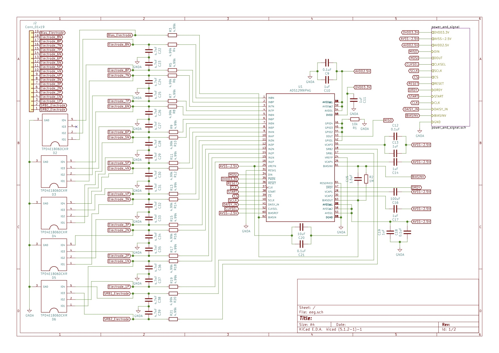
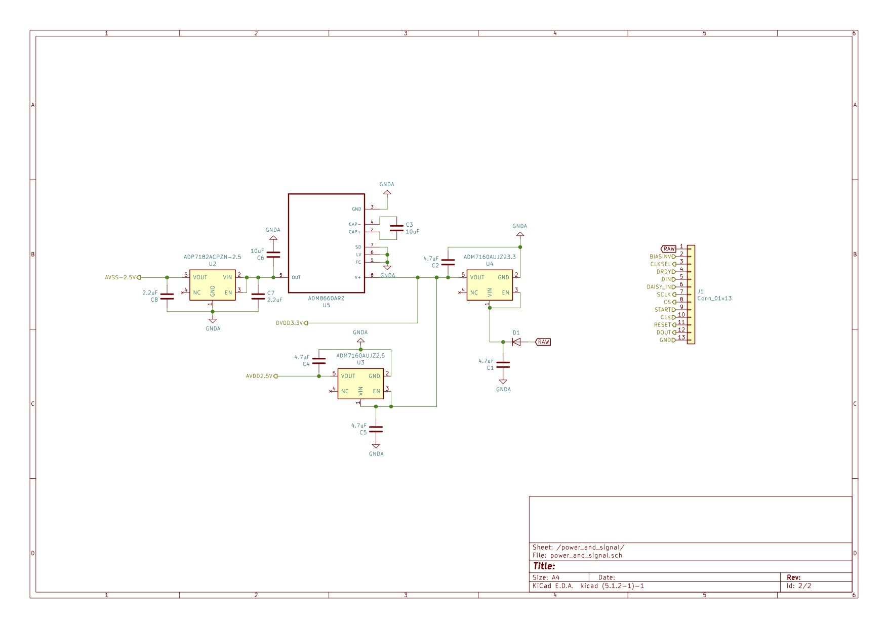

# Lucid Candy
A bare minimum 8 channel EEG board with TI ads1299 chip. It can be driven with any microcontroller that has 3.3V logic. Multiple boards can be chained together to record with 16 or 24 channels. This repository includes KiCad files and SPI example.

## Disclaimer
It still needs a lot of improvement, professional guidance and review. In no way it's fully tested to perform under clinical setting. Please use basic principles to test and evaluate before using it. All suggestions are highly appreciated: gian@bettermetoo.com

## Who should use it?
No one really should, but if you're a newbie in electronics, software, and neuroscience, and want to learn more by building, then this might be a thing for you. If you're just looking for an affortable EEG, there're better open source ones out there, such as [OpenBCI](https://openbci.com/).

## Files & Locations
|-- lucid_candy
|---- component_datasheet // important datasheet of the components used for the board  
|---- e_component         // all the KiCad pcb footprint (from SnapEDA) for the components  
|---- eeg                 // KiCad design files  
|---- firmware            // example of Arduino DUE communicating with the board via SPI  
|---- gerber_zip          // same file used to produce the current board with JLCPCB  

## Schematics
The philosophy with current version of the design is to work within TI's recommendation, and choose components with least amount of tolerance/inductance to develope a baseline. In the future, any design improvement can be evaluated/compared to the current design.

## Components
All the component used can be found [here][https://docs.google.com/spreadsheets/d/1N4UGuHjUGolRgQoIL3MemhwEijfZmJlSR52b1LrSyF4/edit?usp=sharing]. Some of these are pretty over priced. In most situations, you can probably get away with cheaper parts.

## miscellaneous
Some silly questions I asked:
 - [voltage offset][https://e2e.ti.com/support/data-converters/f/73/p/912858/3374371#3374371]
